基于SpringBoot的名城小区物业管理系统（程序+论文）
=
- 完整代码获取地址：从戎源码网 ([https://armycodes.com/](https://armycodes.com/))
- 作者微信：19941326836  QQ：952045282 
- 承接计算机毕业设计、Java毕业设计、Python毕业设计、深度学习、机器学习
- 选题+开题报告+任务书+程序定制+安装调试+论文+答辩ppt 一条龙服务
- 所有选题地址https://github.com/nature924/allProject

一、项目介绍
---
基于Spring Boot框架实现的名城小区物业管理系统，系统包含两种角色：管理员、用户,系统分为前台和后台两大模块，主要功能如下。
### 前台：

首页：展示小区的基本信息和公告通知等内容。
房屋：展示小区房屋信息。
论坛：提供小区住户之间的互动平台。
通知：展示小区物业管理部门发布的通知消息。
个人中心：用户可以管理个人信息。

### 后台：
### 用户：
个人中心：用户可以管理个人信息。
报修管理：用户可以提交报修申请。
房屋管理：用户可以管理自己的房屋信息。
小区环境管理：用户可以管理小区环境信息。
缴费管理：用户可以查询缴费信息。
通知管理：用户可以管理通知信息。
轮播图信息：用户可以管理网站首页的轮播图信息，包括添加、编辑、删除轮播图等操作。

### 管理员：
个人中心：管理员可以管理个人信息，包括修改个人资料。
报修管理：管理员可以处理用户提交的报修申请。
基础数据管理：管理员可以管理系统的基础数据，包括小区信息、房屋信息等。
论坛管理：管理员可以管理论坛信息，包括帖子

### 管理、评论管理等。
房屋管理：管理员可以管理房屋信息，包括添加、编辑、删除房屋信息等操作。
小区环境管理：管理员可以管理小区环境信息，包括投诉、建议等相关操作。
缴费管理：管理员可以管理缴费信息，包括查询、催缴等操作。
通知管理：管理员可以管理通知信息，包括发布、编辑、删除通知等操作。
住户管理：管理员可以管理住户信息，包括添加、编辑、删除住户等操作。
员工管理：管理员可以管理员工信息，包括添加、编辑、删除员工等操作。
轮播图信息：管理员可以管理网站首页的轮播图信息，包括添加、编辑、删除轮播图等操作。

### 员工：
个人中心：员工可以管理个人信息，包括修改个人资料。
报修管理：员工可以处理用户提交的报修申请。
房屋管理：员工可以管理房屋信息，包括添加、编辑、删除房屋信息等操作。
小区环境管理：员工可以管理小区环境信息，包括投诉、建议等相关操作。
缴费管理：员工可以管理缴费信息，包括查询、催缴等操作。
通知管理：员工可以管理通知信息，包括发布、编辑、删除通知等操作。
轮播图信息：员工可以管理网站首页的轮播图信息，包括添加、编辑、删除轮播图等操作。

二、项目技术
---
- 编程语言：Java
- 数据库：MySQL
- 项目管理工具：Maven
- 前端技术：VUE、HTML、Jquery、Bootstrap
- 后端技术：Spring、SpringMVC、MyBatis

三、运行环境
---
- 操作系统：Windows、macOS都可以
- JDK版本：JDK1.8以上都可以
- 开发工具：IDEA、Ecplise、Myecplise都可以
- 数据库: MySQL5.7以上都可以
- Tomcat：任意版本都可以
- Maven：任意版本都可以

四、运行截图
---
### 论文截图：
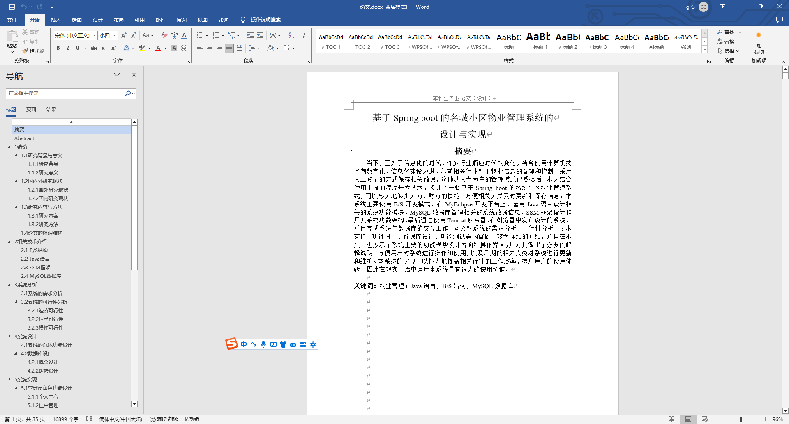
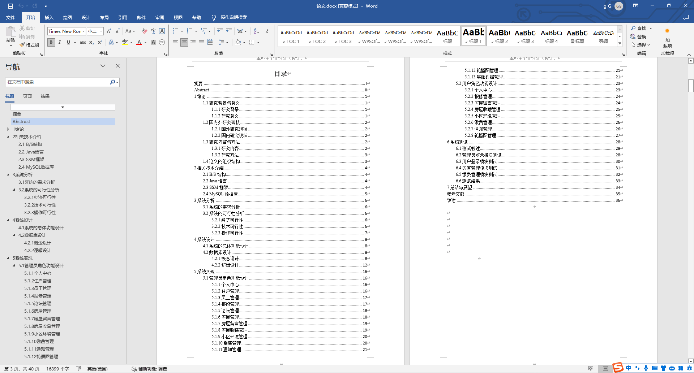

### 程序截图：
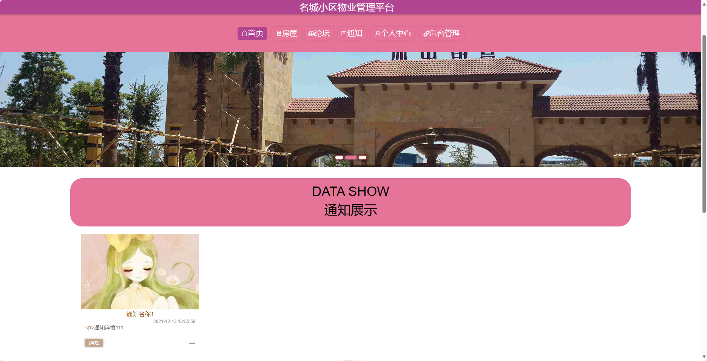
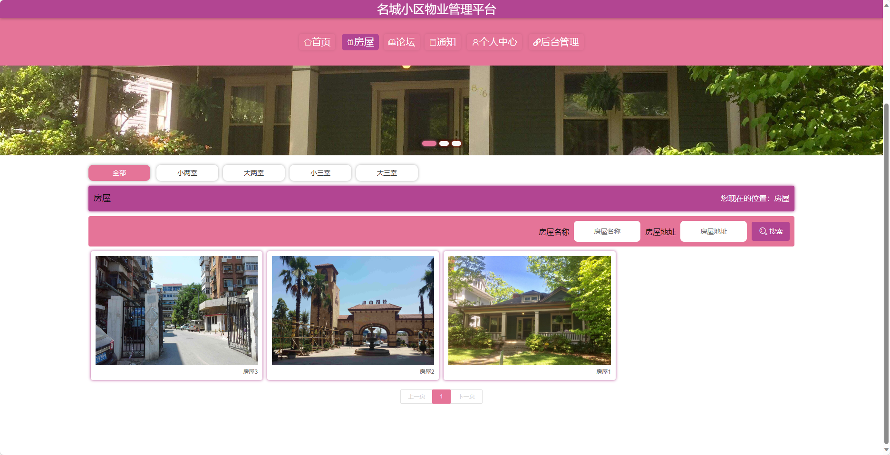
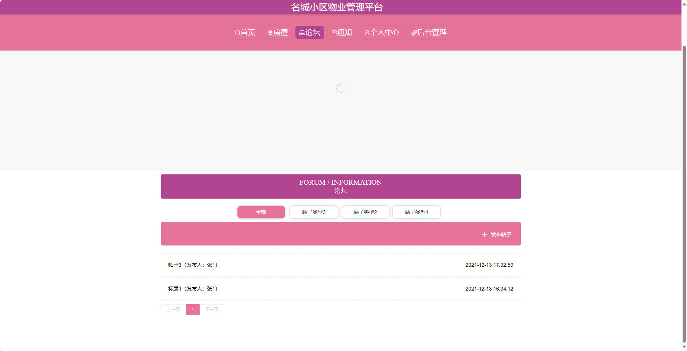
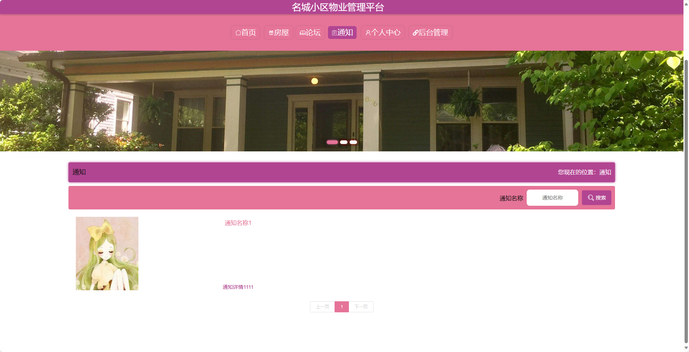
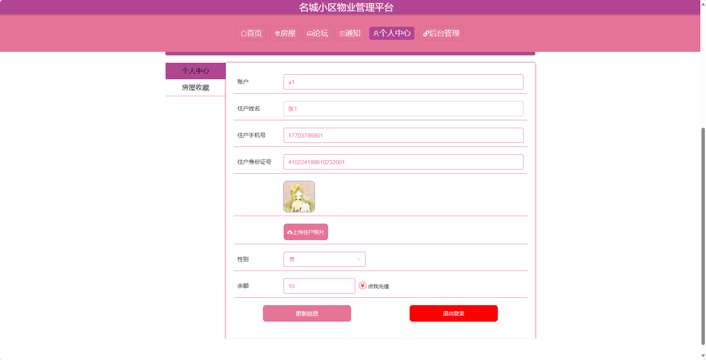
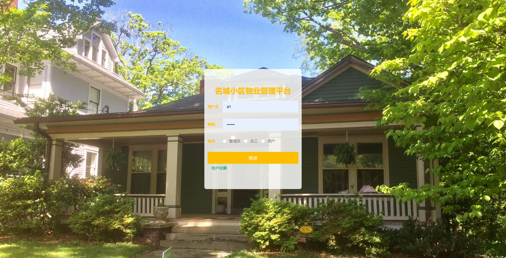
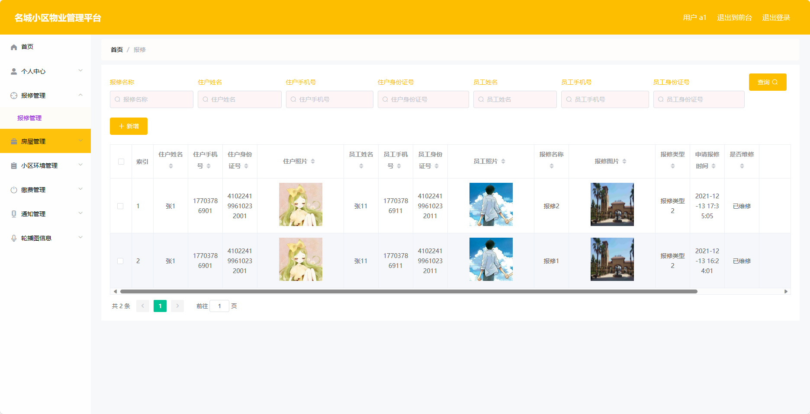
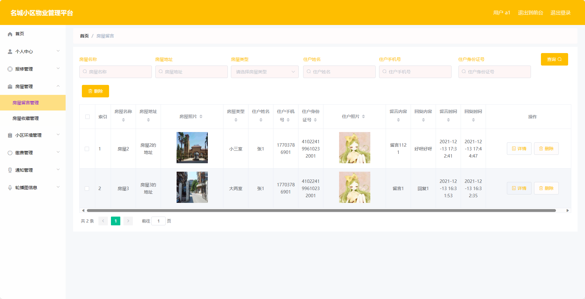
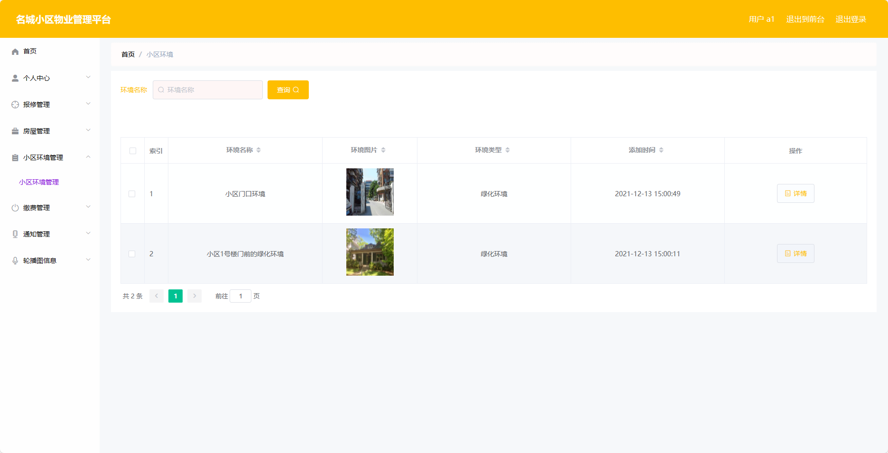
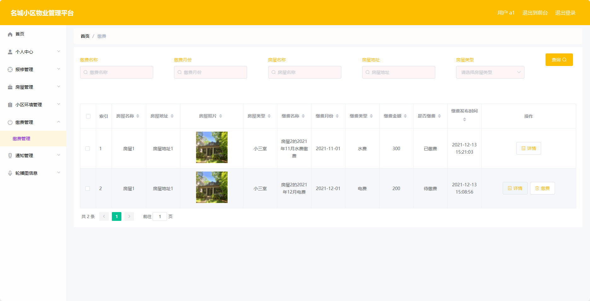

